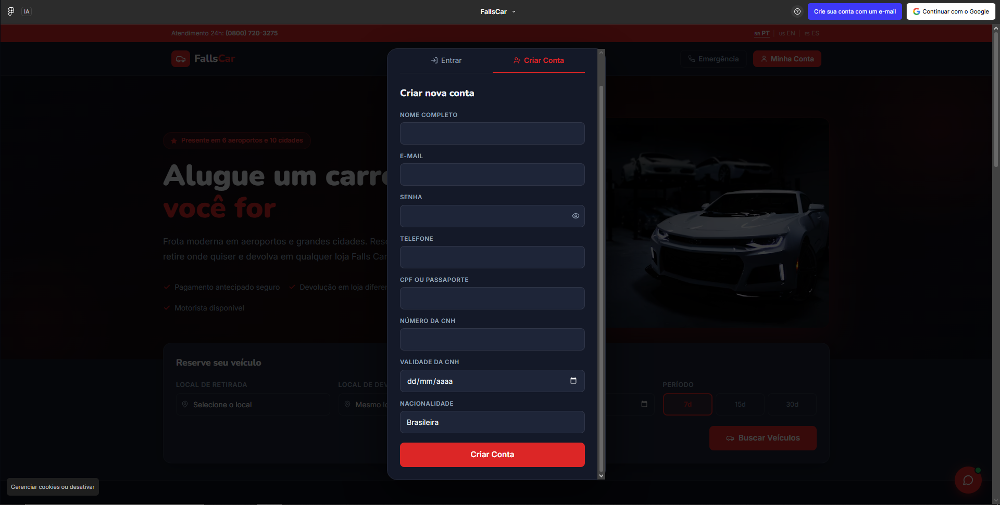
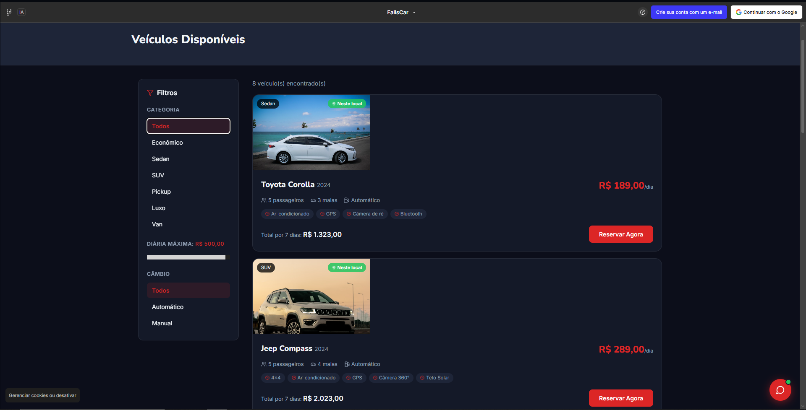
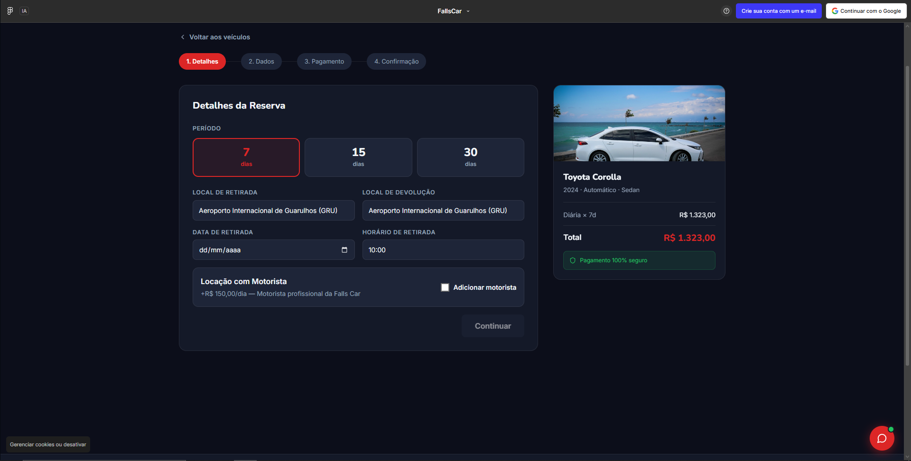
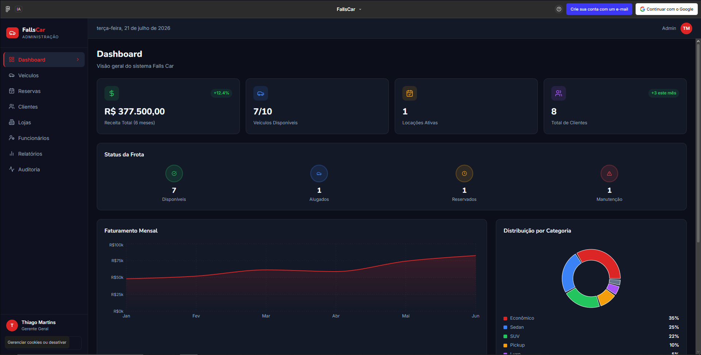

# 🚗 Falls-Car

FAETERJ Status Projeto Acadêmico UML Engenharia de Software

Sistema de Gerenciamento de Aluguel de Veículos desenvolvido como projeto acadêmico da disciplina Introdução à Análise de Sistemas da FAETERJ.

---

## 📖 Sobre o Projeto

O Falls-Car é um sistema de gerenciamento para empresas de aluguel de veículos desenvolvido como projeto acadêmico da disciplina Introdução à Análise de Sistemas, do curso de Análise e Desenvolvimento de Sistemas da FAETERJ-Rio.

O projeto teve como objetivo aplicar conceitos de Engenharia de Software, incluindo levantamento de requisitos, análise de sistemas, modelagem UML e documentação técnica para criação de uma solução voltada ao gerenciamento de locações de veículos.

---

## 🚗 Sobre o Sistema

O Falls-Car busca facilitar o processo de aluguel de veículos, permitindo que clientes realizem consultas e reservas, enquanto a empresa possui ferramentas para administrar sua frota, clientes e operações internas.

O sistema contempla diferentes perfis de usuários, cada um com suas respectivas funcionalidades.

---

## 🚀 Funcionalidades

### 👤 Área do Cliente

- Cadastro e autenticação de usuários
- Consulta de veículos disponíveis
- Visualização de informações dos veículos
- Reserva de veículos
- Gerenciamento de locações
- Histórico de reservas
- Avaliação dos serviços

### 🏢 Área Administrativa

- Cadastro e gerenciamento de veículos
- Controle da frota disponível
- Gerenciamento de clientes
- Controle de funcionários
- Gerenciamento de lojas
- Acompanhamento de reservas
- Relatórios administrativos

---

## 🛠 Tecnologias Utilizadas

- UML
- Engenharia de Software
- Modelagem de Sistemas
- Documentação Técnica

---

## 📚 Engenharia de Software

Durante o desenvolvimento foram realizadas as seguintes etapas:

- Levantamento de requisitos
- Análise de requisitos
- Documento de requisitos
- Identificação de regras de negócio
- Modelagem UML
- Diagrama de Casos de Uso
- Documentação técnica

---

## 🎯 Competências Desenvolvidas

- Levantamento de requisitos
- Análise de Sistemas
- Engenharia de Software
- Modelagem UML
- Documentação de Software
- Identificação de regras de negócio
- Trabalho em equipe

---

## 📄 Documentação

A documentação completa do projeto está disponível na pasta `docs/`.

Ela inclui:

- Documento de Requisitos
- Regras de Negócio
- Diagrama de Casos de Uso
- Diagramas UML

---

## 📷 Interface

### Tela Inicial

### Cadastro de Usuário

### Filtro de Carros

### Reserva de Veículo

### Painel Administrativo

---

## 👨‍💻 Autores

Marcus Vinicius Simões Bordignon  
Tiago Luiz da Silva Perri
Vitória Nogueira Fernandes

Projeto desenvolvido durante o 1º período do curso de Análise e Desenvolvimento de Sistemas da FAETERJ-Rio.
